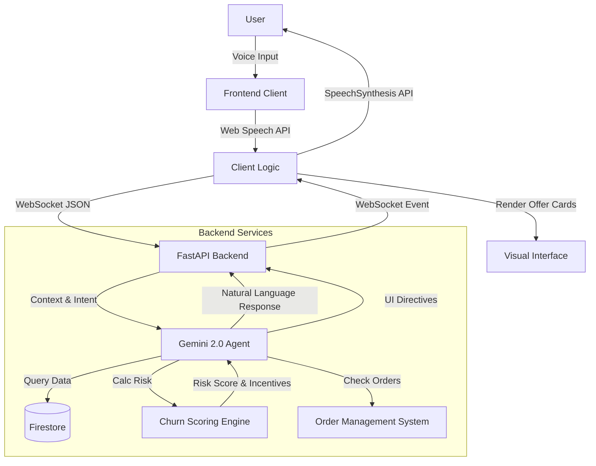

<div align="center">

# Kineo

### Intelligent Voice Agent for Customer Retention

[](https://deepmind.google/technologies/gemini/)
[](https://fastapi.tiangolo.com/)
[](https://firebase.google.com/docs/firestore)
[]()

**Engage • Retain • Recover**

[Features](#key-features) • [Architecture](#architecture) • [Getting Started](#getting-started) • [Documentation](#api-documentation) • [Roadmap](#roadmap)

</div>

---

## Table of Contents

- [Overview](#overview)
- [Key Features](#key-features)
- [Architecture](#architecture)
- [Workflow Diagram](#workflow-diagram)
- [Technology Stack](#technology-stack)
- [Getting Started](#getting-started)
- [Usage](#usage)
- [API Documentation](#api-documentation)
- [Roadmap](#roadmap)
- [License](#license)

---

## Overview

**Kineo** is an enterprise-grade real-time AI voice agent designed specifically for e-commerce customer retention. It bridges the gap between traditional support and modern AI by leveraging **Google's Gemini 2.0 Flash** model to engage customers in natural, low-latency voice conversations.

Unlike standard chatbots, Kineo actively assesses churn risk in real-time and dynamically deploys retention strategies—such as personalized offers and cashback incentives—directly into the user interface during the conversation.

### Why Kineo?

- **Zero-Latency Voice** - Browser-native Web Speech API for instant interaction without plugins
- **Dynamic Risk Scoring** - "Churn Engine" evaluates sentiment and history in real-time
- **Visual Retention Cards** - UI adapts to conversation context (e.g., popping up a Discount Card)
- **Seamless Integration** - Connects with Order Management Systems (OMS) for live tracking
- **Environment-Aware** - Auto-configures for Local, Render, or Railway deployments
- **Full Observability** - Structured session logs stored in Firestore for analytics

---

## Key Features

### 1. Real-Time Voice Interaction
**Browser-Native STT/TTS:**
- **No Third-Party Audio Plugins** - Uses standard `SpeechRecognition` and `SpeechSynthesis` APIs
- **Queue-Based Audio** - Prevents audio collisions between apology messages and offers
- **Visual Feedback** - Real-time waveforms and transcription updates
- **WebSocket Streaming** - Full duplex communication for immediate agent responses

### 2. Dynamic Churn Risk Assessment
The backend implements a dedicated scoring engine:
- **Sentiment Analysis** - Evaluates user tone and frustration levels
- **History Weighting** - Factors in customer tenure and return history
- **Instant Categorization** - Low, Medium, or High risk tiers assigned millisecond-by-millisecond
- **Triggered Responses** - Risk scores drive the agent's negotiation strategy

### 3. Intelligent Retention Offers
Kineo moves beyond text by controlling the UI:
- **Smart UI Cards** - Agent can push rich JSON payloads to the frontend
- **Interactive Elements** - Users can click "Accept Offer" buttons generated by the agent
- **Visual Cues** - Marquee animations and color shifts based on conversation state
- **Context Awareness** - Offers match the specific complaint (e.g., specific product refund vs general credit)

### 4. Integrated Order Management
Simulates a full enterprise OMS:
- **Live Status Checks** - "Where is my order?" queries hit the `order_service`
- **Return Eligibility** - Automatically validates return windows
- **Shipping Updates** - Provides tracking details and dates
- **Webhook Support** - Ready to receive real external updates

### 5. Comprehensive Session Logging
- **Firestore Integration** - Every turn of conversation is structured and saved
- **Metadata Tagging** - Transcripts tagged with final churn score and outcome
- **Analytics Ready** - Data structure optimized for future model fine-tuning

---

## Architecture

Kineo follows a high-performance modular architecture:

```
┌─────────────────────────────────────────────────────────────────┐
│                    Frontend (Browser Client)                    │
│  • Web Speech API (STT/TTS)                                     │
│  • WebSocket Client (WSS/WS)                                    │
│  • Dynamic UI Cards (Vanilla JS/Neo-Brutalist CSS)              │
│  • Environment-Aware Config                                     │
└────┬────────────────────────────────────────────────────────────┘
     │
     ▼
┌─────────────────────────────────────────────────────────────────┐
│                    Backend Server (FastAPI)                     │
│  • Uvicorn ASGI Server                                          │
│  • WebSocket Endpoint (/session)                                │
│  • REST API Endpoints                                           │
└────┬──────────────────────┬──────────────────────┬──────────────┘
     │                      │                      │
     ▼                      ▼                      ▼
┌─────────────────┐  ┌─────────────────┐  ┌─────────────────────┐
│  Session Manager│  │  Churn Engine   │  │   Order Service     │
│                 │  │                 │  │                     │
│ • State Mgmt    │  │ • Risk Scoring  │  │ • Mock OMS          │
│ • Context       │  │ • Offer Logic   │  │ • Status Updates    │
└─────────────────┘  └─────────────────┘  └─────────────────────┘
         │                    │                       │
         ▼                    ▼                       ▼
┌─────────────────────────────────────────────────────────────────┐
│                       External Services                         │
│  • Google Gemini 2.0 Flash (Multimodal AI)                      │
│  • Google Cloud Firestore (Session/User DB)                     │
└─────────────────────────────────────────────────────────────────┘
```

---

## Workflow Diagram

### Voice & Data Flow



---

## Technology Stack

### Frontend
- **Core**: HTML5, CSS3 (Neo-Brutalist Design)
- **Logic**: Vanilla JavaScript (ES6+)
- **Audio**: Web Speech API (`webkitSpeechRecognition`, `speechSynthesis`)
- **Protocol**: Secure WebSockets (`wss://`)

### Backend
- **Framework**: FastAPI (Python 3.10+)
- **Server**: Uvicorn (ASGI)
- **Database**: Google Cloud Firestore (NoSQL)
- **AI Model**: Google Gemini 2.0 Flash (`google-generativeai` SDK)

### Infrastructure
- **Deployment**: Configured for Render / Railway / Vercel (Frontend)
- **Environment**: `.env` driven configuration
- **Dependency Mgmt**: pip / requirements.txt

---

## Getting Started

### Prerequisites

- **Python 3.10** or higher
- **Google Cloud Platform** account (Firestore enabled)
- **Google AI Studio** API Key

### Installation

1. **Clone the repository**
```bash
git clone https://github.com/ChilliRoger/kineo.git
cd kineo
```

2. **Set up Virtual Environment**
```bash
python -m venv .venv
# Windows
.\.venv\Scripts\Activate.ps1
# Mac/Linux
source .venv/bin/activate
```

3. **Install Dependencies**
```bash
pip install -r requirements.txt
```

4. **Environment Configuration**
Create a `.env` file in the root directory:
```env
GOOGLE_API_KEY=your_gemini_api_key
GCP_PROJECT_ID=your_gcp_project_id
FIRESTORE_COLLECTION_CUSTOMERS=kineo_customers
FIRESTORE_COLLECTION_SESSIONS=kineo_sessions
# Optional: Service Account if not using default auth
GOOGLE_APPLICATION_CREDENTIALS=service-account.json
```

### Running the Application

1. **Start the Backend**
```bash
uvicorn main:app --reload
```
Server starts at `http://localhost:8000`

2. **Launch Frontend**
Open `http://localhost:8000/` in your browser.

3. **Production Deployment**
- **Backend**: Push to Render/Railway using the provided `render.yaml` or `Procfile`.
- **Frontend**: Deploy to Vercel/Netlify. Update `CONFIG_BACKEND_URL` in `index.html`.

---

## Usage

### Voice Commands

#### Order Status
> "Where is my latest order?"
> "Has the package meant for Sarah arrived yet?"

#### Returns & Complaints
> "I want to return the bluetooth speaker."
> "This product is defective and I'm very unhappy."

#### Account Info
> "What is my current loyalty tier?"
> "Do I have any active subscriptions?"

---

## API Documentation

### HTTP Endpoints

**GET /health**
- Health check and model status.
- Response: `{"status": "ok", "model": "gemini-2.0-flash-exp"}`

**GET /customer/{customer_id}**
- Fetch full customer profile and stats.

**GET /orders/customer/{customer_id}**
- List recent orders and shipping status.

### WebSocket Protocol

**Endpoint**: `/session`

**Client -> Server**
```json
{
  "type": "transcript",
  "text": "User spoken text"
}
```

**Server -> Client**
```json
// Agent Speech
{
  "type": "audio",
  "text": "I can help with that return..."
}

// UI Trigger
{
  "type": "offer",
  "data": {
    "title": "20% Cashback",
    "churn_score": 85,
    "action": "refund_init"
  }
}
```

---

## Roadmap

### Phase 1: Core Foundation (Completed)
- [x] Basic Voice Agent architecture
- [x] Gemini 2.0 Integration
- [x] Firestore logging
- [x] Basic UI implementation

### Phase 2: Intelligence & UI (Completed)
- [x] Churn Scoring Algorithm
- [x] Dynamic UI Cards (Offer/Cashback)
- [x] Environment-agnostic Websockets
- [x] Deployment configuration (Render/Vercel)

### Phase 3: Advanced Features (Q2 2026)
- [ ] Multi-lingual support (Spanish/French)
- [ ] Voice biometrics for authentication
- [ ] CRM Integration (Salesforce/HubSpot)
- [ ] Advanced visual dashboards for Admins

---

## License

This project is licensed under the **MIT License**.

<div align="center">

**Built for the future of customer retention**

[Back to Top](#kineo)

</div>
